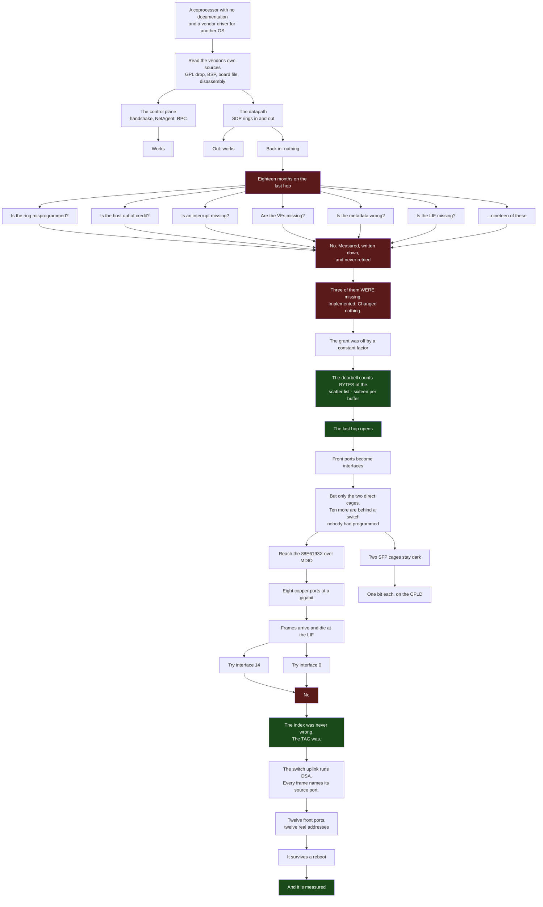

# How it was found

A map of the work, and it is deliberately not a list of achievements. **The dead ends are the
expensive part** - they are where the months went - so they are drawn at the same size as the things
that worked, and the page is more useful for them.

If you want what is true now, read
[families/octeon-tx-reference.md](families/octeon-tx-reference.md). If you want the numbers,
[measurements/xgs3300.md](measurements/xgs3300.md). This page is about the shape of getting there.

## The size of it

| | |
|---|---|
| commits in this repository | 151, across `2026-09-25` to `2026-10-01` |
| changes merged by pull request | 107 |
| issues opened | 30, of which 26 are closed |
| lines of driver | ~7,500 for `octep`, ~16,000 across all of `contrib/` |
| lines of documentation | ~6,600 |
| **things tried against the last hop and recorded as not working** | **19** |
| claims published and later withdrawn on this page's subject | 8 |

The repository is a week old. The **problem** is not: the blocker that nineteen of those negatives
were aimed at had been open for eighteen months before the week that closed it.

## The shape of it

## What a frame crosses today

Eleven things have to be right at once for one packet, and each of them was a separate piece of
work. That is the honest measure of the size of this, more than any commit count:

```mermaid
flowchart LR
    W(("wire")) --> P1["copper panel port<br/>PHY powered, page 0, 0x1140"]
    P1 --> SW["88E6193X<br/>forwarding, TCAM entry live<br/>because the host named the MAC"]
    SW --> DSA["uplink in DSA frame mode<br/>tags every frame with its source port"]
    DSA --> FP["the coprocessor's fast path<br/>tag to LIF index, MTU, forwarding mode"]
    FP --> RING["SDP output ring<br/>granted in the block's own unit"]
    RING --> PCI(("PCIe"))
    PCI --> DRV["octep<br/>82-byte prefix, tag to ifnet"]
    DRV --> MB["mbuf"]
    MB --> IF["oxpN<br/>its own MAC, its own link state"]
    IF --> PF["pf"]
    PF --> OS(("OPNsense"))
```

## The dead ends, and what each one cost

Nineteen were recorded against the last hop alone. These are the ones whose lesson outlived them:

| what was believed | what it cost | what was actually true |
|---|---|---|
| the ring is misprogrammed | weeks of register sweeps | it was programmed correctly the whole time |
| the host is out of credit | a reading of the doorbell that was **worthless**, because the grant it reported had been corrupt since the ring was first armed | the register counts bytes, not entries |
| the coprocessor is not deciding to forward | a search for a forwarding mechanism that does not exist | it was deciding correctly; the frames were asking to be encrypted |
| the cage LEDs show traffic | a published claim, later withdrawn | those cages have **no LED key at all** in the board file |
| the LIF index is wrong | two interface numbers tried and a third being searched for | the index was right; the **tag** was a value the far side never produces |
| the sensors are on the host's SMBus | three probes, two of them invalidated by a controller left stuck | the bus the controller serves has nothing on it, not even DIMM SPD |
| a PON stick is not an Ethernet module | a cage written off as unusable | an ONU stick presents 1000BASE-X like anything else; its laser was simply off |

**And one that is not a dead end but a method.** `0xFE 0x58` in the panel's protocol is the escape
followed by the letter `X` - and a row of `X` characters on the display was the clue that the escape
was not being honoured. The byte that looked like garbage was the answer.

## What this project does instead of guessing

Four rules, all of them learned by paying for the alternative:

1. **Read the vendor's own sources before probing the hardware.** The port tags, the DSA tag format,
   the LED scheme, the CPLD's pins, the panel's protocol and the sensor map were all in files
   already on disk. One of them - the port tag table - had been **published in this repository's own
   reference page for months** while the driver used values the far side never produces.
2. **Write down what did not work, with the measurement.** Nineteen negatives meant nineteen things
   nobody retried.
3. **Withdraw a claim in the same place it was made.** Eight on the OCTEON TX page alone, struck
   through rather than deleted, because a log that quietly edits itself is not a log.
4. **A number that has not been taken is not a number nobody needs.** Row five of the progress table
   read 0% for months. Measuring it took an afternoon and showed the driver already had six and a
   half times the headroom ten of the twelve ports need.
