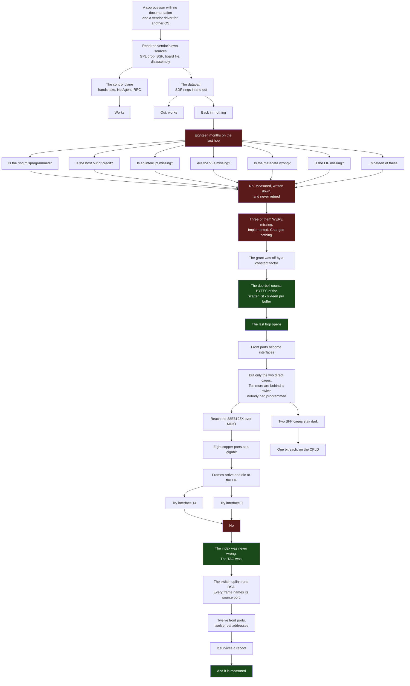
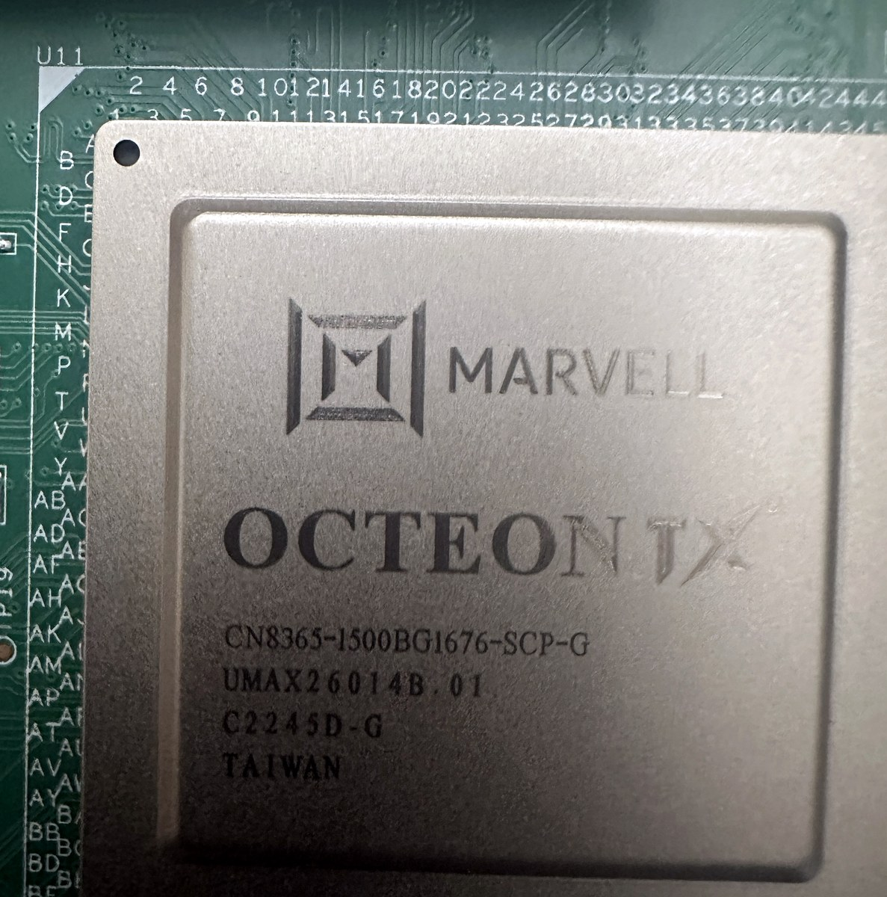
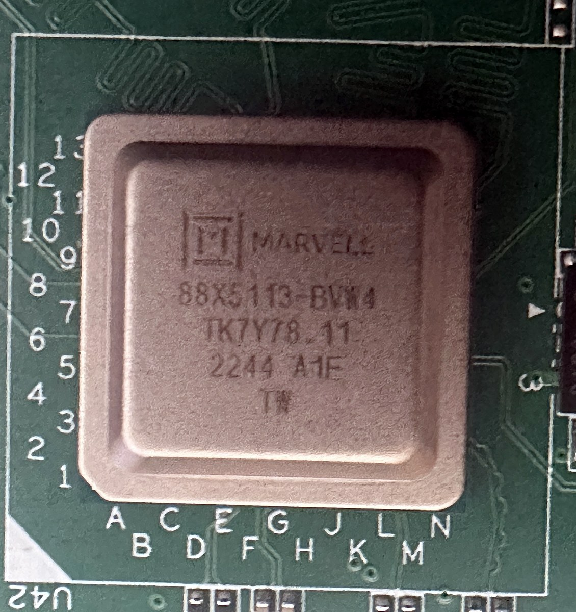
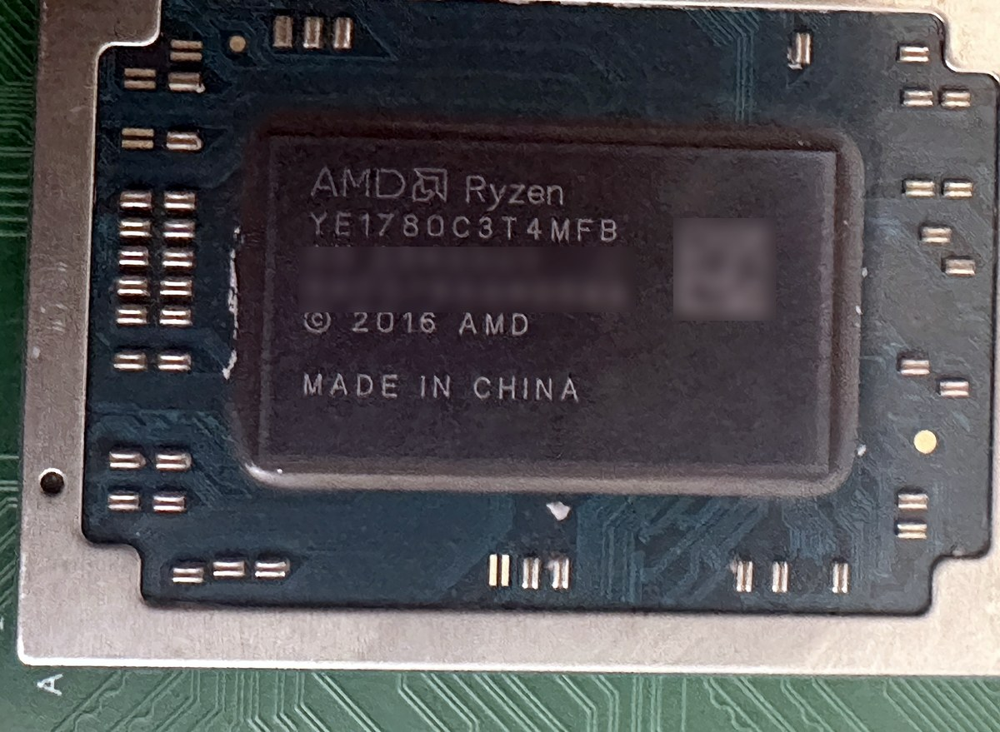
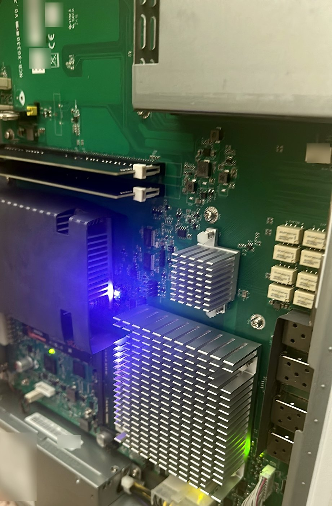

# How it was found

A map of the work, and it is deliberately not a list of achievements. **The dead ends are the
expensive part** - they are where the months went - so they are drawn at the same size as the things
that worked, and the page is more useful for them.

If you want what is true now, read
[families/octeon-tx-reference.md](families/octeon-tx-reference.md). If you want the numbers,
[measurements/xgs3300.md](measurements/xgs3300.md). This page is about the shape of getting there.

## The size of it

| | |
|---|---|
| commits in this repository | 166, across `2026-09-25` to `2026-10-01` |
| changes merged by pull request | 157 |
| issues opened | 32, of which 27 are closed |
| lines of driver | 7,903 for `octep`, 16,441 across all of `contrib/` |
| lines of documentation | 7,651 |
| **things tried against the last hop and recorded as not working** | **19** |
| claims published and later withdrawn on this page's subject | **10** |

**One of those figures was wrong here until it was recounted.** This page said 107 changes merged;
it was 154 when that was caught and 157 by the end of the same evening, which is why the table
above and this sentence do not match - the table is a count and this is an account. `gh pr list` returns thirty rows unless it is told otherwise, and the first
count took the default and believed it. A page about not guessing had a guess in its own table.

**The tenth withdrawal is this page's own neighbour.** Hours after the front panel's
micro-controller was photographed, this project published that the panel's protocol is the bridge's
own and that the `0xFE` escape had been the wrong thing to chase. The vendor's daemon sends exactly
that escape to exactly that panel and it works, so the claim was wrong and it was withdrawn the
same evening. It was caught because someone read the summary table further down this page, saw that
it still said the old thing, and asked which of the two was wrong. **A stale page is an
instrument**, and that is the second time in one day that the oldest text in the repository
corrected the newest.

**And the issue count was right by luck, which is worse.** The same command caps at thirty, and
there were thirty issues, so the broken method printed the true number. It would have printed
thirty if there had been three hundred. A figure that cannot be wrong when the method is wrong is
not evidence of anything, and the only reason this one is trusted now is that it was taken again
with the limit set.

The repository is a week old. The **problem** is not: the blocker that nineteen of those negatives
were aimed at had been open for eighteen months before the week that closed it.

## The shape of it

## What a frame crosses today

Eleven things have to be right at once for one packet, and each of them was a separate piece of
work. That is the honest measure of the size of this, more than any commit count:

```mermaid
flowchart LR
    W(("wire")) --> P1["copper panel port<br/>PHY powered, page 0, 0x1140"]
    P1 --> SW["88E6193X<br/>forwarding, TCAM entry live<br/>because the host named the MAC"]
    SW --> DSA["uplink in DSA frame mode<br/>tags every frame with its source port"]
    DSA --> FP["the coprocessor's fast path<br/>tag to LIF index, MTU, forwarding mode"]
    FP --> RING["SDP output ring<br/>granted in the block's own unit"]
    RING --> PCI(("PCIe"))
    PCI --> DRV["octep<br/>82-byte prefix, tag to ifnet"]
    DRV --> MB["mbuf"]
    MB --> IF["oxpN<br/>its own MAC, its own link state"]
    IF --> PF["pf"]
    PF --> OS(("OPNsense"))
```

## The last day, which was a quarter of the whole

2026-10-01 is in the figures above as one date among seven, and it carried eight merges. They are
worth naming because three of them changed what the project is, rather than adding to it.

**A frame posted for one front port could leave by another.** Twelve interfaces shared one transmit
buffer: a frame was copied in, an instruction pointing at it was posted, the lock was dropped, and
the next frame overwrote it before the coprocessor had read it. At 1.9 microseconds a packet that
is the normal case. Nothing was dropped - frames were **replaced**, and went out of a different port
with another port's tag. Every counter agreed with every other one the whole time, because the
count was always right and only the contents were wrong. What found it was loading one port and
watching a different one, and one buffer per instruction slot took the loss from 29% to 0.0% at
every rate.

**IPv6 started working**, because `SIOCADDMULTI` stopped being a no-op and the port is now asked to
pass multicast. A ping to `ff02::1` came back from more than twenty neighbours on a front port that
could not have seen one of them the day before.

**The crypto engine answered.** A security association installs and reads back, and the two
metadata bytes that ask for encryption were found by bisection. It stops at one named counter, and
that counter is now an issue with the question written on it.

And the appliance was opened and photographed, which settled three things that reading could not -
including what the front panel really is.

## The dead ends, and what each one cost

Nineteen were recorded against the last hop alone. These are the ones whose lesson outlived them:

| what was believed | what it cost | what was actually true |
|---|---|---|
| the ring is misprogrammed | weeks of register sweeps | it was programmed correctly the whole time |
| the host is out of credit | a reading of the doorbell that was **worthless**, because the grant it reported had been corrupt since the ring was first armed | the register counts bytes, not entries |
| the coprocessor is not deciding to forward | a search for a forwarding mechanism that does not exist | it was deciding correctly; the frames were asking to be encrypted |
| the cage LEDs show traffic | a published claim, later withdrawn | those cages have **no LED key at all** in the board file |
| the LIF index is wrong | two interface numbers tried and a third being searched for | the index was right; the **tag** was a value the far side never produces |
| the sensors are on the host's SMBus | three probes, two of them invalidated by a controller left stuck | the bus the controller serves has nothing on it, not even DIMM SPD |
| a PON stick is not an Ethernet module | a cage written off as unusable | an ONU stick presents 1000BASE-X like anything else; its laser was simply off |

**And one that is not a dead end but a method.** `0xFE 0x58` in the panel's protocol is the escape
followed by the letter `X` - and a row of `X` characters on the display was the clue that the escape
was not being honoured. The byte that looked like garbage was the answer.

## What this project does instead of guessing

Four rules, all of them learned by paying for the alternative:

1. **Read the vendor's own sources before probing the hardware.** The port tags, the DSA tag format,
   the LED scheme, the CPLD's pins, the panel's protocol and the sensor map were all in files
   already on disk. One of them - the port tag table - had been **published in this repository's own
   reference page for months** while the driver used values the far side never produces.
2. **Write down what did not work, with the measurement.** Nineteen negatives meant nineteen things
   nobody retried.
3. **Withdraw a claim in the same place it was made.** Eight on the OCTEON TX page alone, struck
   through rather than deleted, because a log that quietly edits itself is not a log.
4. **A number that has not been taken is not a number nobody needs.** Row five of the progress table
   read 0% for months. Measuring it took an afternoon and showed the driver already had six and a
   half times the headroom ten of the twelve ports need.

## The three parts this is all about

Photographed on the appliance, because every number in this repository was read from a file until
somebody opened the box. The markings below are the parts' own, from the silicon.

| | |
|---|---|
|  | **`MARVELL OCTEON TX`** &mdash; `CN8365-1500BG1676-SCP-G`, at board position `U11`. This is the coprocessor that owns the twelve front ports, and everything in this repository is about reaching it. The platform database named it; this is the die cap saying the same thing. |
|  | **`88X5113-BVM4`** &mdash; `2244 A1F`, at `U42`. The 10G PHY behind PortF1 and PortF2, which the board file reaches at `mdio45:0:7`. A claim about this part was withdrawn once in this project, over a register that was never the indicator it was taken for; the part itself was never in doubt and now it is on a photograph. |
|  | **`AMD Ryzen YE1780C3T4MFB`** &mdash; the V1780B, the x86 host, and the other end of the PCIe link. Its unit codes and data matrix are blurred; the model number is the evidence and stays. |

**And a second set, taken later and with better light**, is in
[octeon-tx-peripherals.md](families/octeon-tx-peripherals.md#the-board-photographed): the front
panel's own micro-controller, the nine bypass relays, the service headers with what each one takes
to use, the management NIC, and the carrier board carrying a name nobody expected. Three of those
pictures settled questions that reading could not.

*Inside, with the lid off: the two heatsinks, the SFP cages down the right edge, the relay bank
beside them, and a single blue indicator that is the only light this board shows without software.
Every printed label has been blurred - a photograph of somebody's hardware must not carry its
serial numbers, and the repository's own private-data checker reads text rather than images, so
that one is done by hand.*

## Two thin channels carried all of it

Neither of the paths that opened this appliance is fast, and the gap between what they carry and
what they unlocked is the real measure of the work.

**SPI reaches exactly one device: the CPLD.** `npu0.cpld.location=spi:0:1:3` puts it on the
**coprocessor's** SPI rather than the host's - `/dev/spidev0.1`, mode 3, 3 MHz. A read is one byte
of `reg | 0x80` and then four big-endian bytes; a write is a single five-byte transfer; every
register is 32 bits wide. What rides on that one bus is most of the board that is not a network
port: the four SFP cages' pins in register `0x25`, the fail-to-wire relay at `0x39`, `0x3a` and
`0x3b`, the SFF event register at `0x38`, and the block id and version that let a read be checked
before it is believed. **Clearing one bit on that bus is what lit a cage that had been dark since
the appliance was built.**

**And there are three UARTs, all on the host, doing three unrelated jobs:**

| port | address | what it is | speed |
|---|---|---|---|
| `uart0` | `0x3f8` | the host's own console | 115200, and 38400 under the vendor's firmware |
| `uart1` | `0x2f8` | **the front panel**, through an EZIO bridge | `0xFE` then an HD44780 instruction, which is what the vendor's daemon sends; the rate is the open question |
| `uart2` | `0x3e8` | **the coprocessor's console** | 115200 raw, and it needs a device hint to appear |

Two of those three were not documentation but tools. `uart2` is how `mvsw` got onto the coprocessor
at all - sixty kilobytes base64'd through a serial line - and therefore how the switch behind the
panel ports was first reached. `uart1` is the panel whose protocol came out of the vendor's own
daemon.

**So: a 3 MHz bus and a 115200 line.** That is what an undocumented coprocessor, a managed switch,
twelve front ports and a CPLD were opened with.
